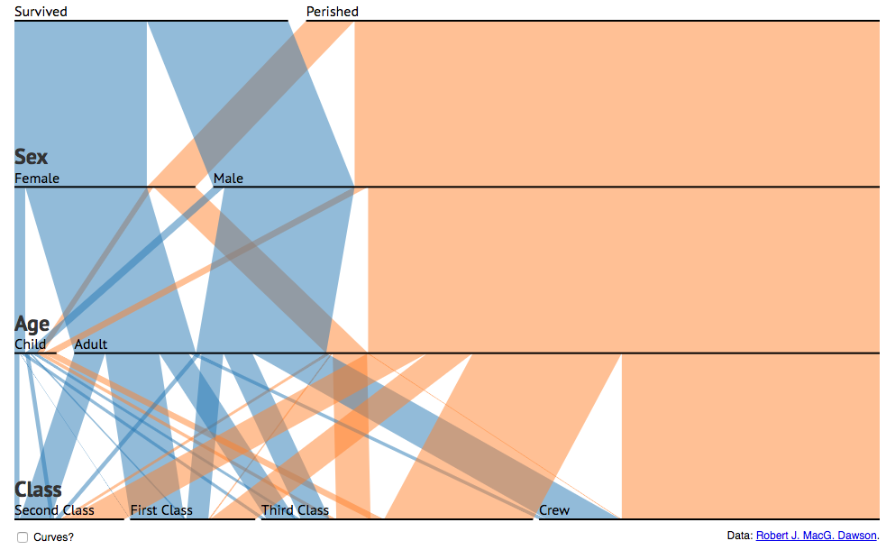
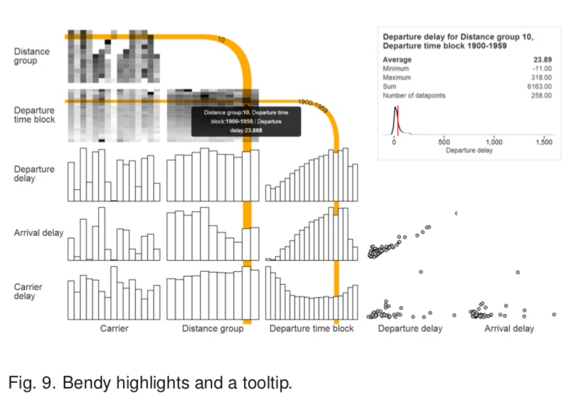

#高维数据可视化
##数据类型
###分类
1. Ordinal：是顺序可以排序的比如你对一个产品的满意度从低到高依次为：非常不满意，不满意，一般，满意，非常满意。  
2. Nominal：是名目，指不能排序的变量，比如血型，性别，职业。  
3. Interval：定距尺度变量（间距尺度变量），数据型变量可以求平均，加减，比如温度。  
4. Ratio：定比变量，拥有零值，及数据间的距离是相等被定义的， 通常指诸如身高、体重、血压等的连续性数据，也包括诸如人数、商品件数等离散型数据，也可以做四则运算。

####Nominal
对于名目类型的数据由于数据往往并不复杂，而且实际应用过程中并不是主流需要可视化的数据，因此目前对其可视化的方式比较少。对于这一类数据，我们往往很难把他转化成有序的数值型，同时，当这一类数据类目较多时（如职业种类太多样等）也很难对其进行可视化表达。

1. [Mapping Nominal Values to Numbers for Effective Visualization.pdf](./nominal data/Mapping Nominal Values to Numbers for Effective Visualization∗.pdf): Nominal数据转化为numerical数据  
			对名目数据进行排序，同时减少名目内类目数量，主要使用方法：Distance-Quantification-Classing (DQC) approach方法。核心思想为将Nominal数据转化为numerical数据，主要思路为，对每一个Nominal的维度将其他Nominal维度（n-1个，每个维度有N(i)种可能的取值）内的值展开看做ΣN(i)个特征，利用PCA选取前k个特征，再利用Optimal Scaling的方法利用特征之间的相关性，计算每一个特征对最终numerical数值的贡献值，通过计算得到每个Nominal的numerical值。最后用层次聚类归纳将相似的Nominal合并  
			ps: 实际操作过程,其实主要用到了距离和相关性的概念，其实可利用其它方法对高维属性直接投影到一维得到一维的numerical值即可（T-sne等方法）
2. [Parallel Sets: Visual Analysis of Categorical Data.pdf](./nominal data/Parallel Sets: Visual Analysis of Categorical Data.pdf)：平行坐标展示法
		使用平行坐标对Nominal数据与numerical数据进行展示，由于平行坐标对数据有序性要求较低，因此可以很好的进行展示。  
	

3. 	[GPLOM: The Generalized Plot Matrix for Visualizing Multidimensional Multivariate Data](./nominal data/GPLOM- The Generalized Plot Matrix for Visualizing Multidimensional Multivariate Data.pdf)：提出了一种如何针对Nominal型数据与numerical类型数据两种异构数据，2X2异构交叉展示的思路，通过逻辑上的排列与特殊的交互，从而实现异构数据以交叉矩阵形式展示的效果。
	
		
4. 	[Visual Correlation Analysis of Numerical and Categorical Data on the Correlation Map](./nominal data/Visual Correlation Analysis of Numerical and Categorical Data on the Correlation Map.pdf)：从不同参数之间的相关性角度进行可视化，论文有些综述性质，同时也提出了一些自己的方法。其中2、3、4章很好的总结了nominal变量与numerical变量转化与处理的方式
		

##维度缩减  
  维度缩减是在做分析与可视化高维数据集时最基本的工具与手段之一，对维度缩减方法可以简单分为两类：线性维度缩减与非线性维度缩减。其中线性降维具有相对结果具有更强的可解释性，非线性的降维可解释性差，但可以展示复杂结构。
###线性降维：
线性投影主要是使用线性变换的方式，将数据从高维空间向低维空间投影。线性投影有很多方法，例如：PCA、MDS（Multidimensional scaling）、LDA（Linear Discriminant Analysis）等
####PCA
意在找到一个正交线性变换，使线性投影之后，维度之间的方差最大化，主要利用了到SVD分解的方式求解方差矩阵最大的前k个特征向量，利用特征向量生成线性变化矩阵。  
[iPCA: An Interactive System for PCA-based Visual Analytics](./Dimension Reduction/iPCA- An Interactive System for PCA-based Visual Analytics.pdf):提出了一个对主成分分析结果的可视化方法，意在帮助用户理解PCA投影过程。  
####MDS(Multidimensional Scaling)  
本质上是一个优化问题，优化目标为最小化投影的偏离度。   
####LDA(Linear Discriminant Analysis)	
LDA主要用来对有标签数据进行可视化。其本质是一种有监督的线性降维算法,与PCA保持数据信息不同，LDA是为了使得降维后的数据点尽可能地容易被区分。其本质也是一个投影与优化问题，优化目标为：尽可能保证类内间距最小，同时尽可能保证类间间距最大。   
[Visualization of labeled data using linear transformations.pdf](./Dimension Reduction/Visualization of labeled data using linear transformations.pdf)概况了利用PCA和LDA对有标签数据进行可视化方法。
###非线性降维：
####Isomap
J. B. Tenenbaum, V. De Silva, and J. C. Langford, “A global geo- metric framework for nonlinear dimensionality reduction,” Sci- ence, vol. 290, no. 5500, pp. 2319–2323, 2000.
####LLE（Locally Linear Embedding)
S. T. Roweis and L. K. Saul, “Nonlinear dimensionality reduction by locally linear embedding,” Science, vol. 290, no. 5500, pp. 2323–2326, 2000.
####LE（Laplacian Eigenmap)
M. Belkin and P. Niyogi, “Laplacian eigenmaps for dimensional- ity reduction and data representation,” Neural Comput., vol. 15, no. 6, pp. 1373–1396, 2003.
####nonmetric MDS or stress-based MDS 

####t-SNE
L. v. d. Maaten and G. Hinton, “Visualizing data using t-SNE,” J. Mach. Learn. Res., vol. 9, pp. 2579–2605, 2008.

###control point Based projection
全局的线性或非线性投影，受到其自身算法的局限，因此往往很难在全局的角度对数据进行抽象，而基于控制点的算法，通过关键节点先投影关键节点，再根据关键节点对拓扑结构进行拓展从而完善整个数据的拓扑结构。这种方法，可以很好的保证局部节点的特征,同时，基于控制点的投影可以很容易的对整个降维过程进行控制与交互（因为操作与分析从集合变成了控制点个体）
V. De Silva and J. B. Tenenbaum, “Sparse multidimensional scal- ing using landmark points,” Stanford Univ., Stanford, CA, USA, Tech. Rep., 2004.  
F. Paulovich, C. Silva, and L. Nonato, “Two-phase mapping for projecting massive data sets,” IEEE Trans. Vis. Comput. Graph., vol. 16, no. 6, pp. 1281–1290, Nov./Dec. 2010.  
F. Paulovich, D. Eler, J. Poco, C. Botha, R. Minghim, and L. Non- ato, “Piece wise laplacian-based projection for interactive data exploration and organization,” Comput. Graph. Forum, vol. 30, no. 3, pp. 1091–1100, 2011.

###Distance Metric:
现有的降维算法，往往是针对距离这一概念进行维度缩减的，因此，一个合适的距离矩阵，对于整个降维而言是至关重要的，从大多数可视化目的的角度而言，其最终的目标都是揭示重要的结构信息。
E. T. Brown, J. Liu, C. E. Brodley, and R. Chang, “Dis-function: Learning distance functions interactively,” in Proc. IEEE Conf. Visual Analytics Sci. Technol., 2012, pp. 83–92：通过领域专家或者相关分析人员通过经验或一些预先构想指定数据点轮廓，从而根据这些控制点家算法生成最终的控制矩阵

M. Gleicher, “Explainers: Expert explorations with crafted pro- jections,” IEEE Trans. Vis. Comput. Graph., vol. 19, no. 12, pp. 2042–2051, Dec. 2013.：通过用户指定的具体结构的例子，以线性方法为基础，利用机器学习的方法，对距离结构进行计算、投影与抽象。

J. H. Lee, K. T. McDonnell, A. Zelenyuk, D. Imre, and K. Mueller, “A structure-based distance metric for high-dimensional space exploration with multidimensional scaling,” IEEE Trans. Vis. Comput. Graph., vol. 20, no. 3, pp. 351–364, Mar. 2014. 提出了一种利用MDS来对高维数据空间结构进行探索的方法。

###降维的精确度估计
对于降维对计算的最终估计结果的评估也是在进行降维时的重要挑战  
⭐️ J. A. Lee and M. Verleysen, “Quality assessment of dimensional- ity reduction: Rank-based criteria,” Neurocomputing, vol. 72, no. 7, pp. 1431–1443, 2009.通过对降维前后数据的主要差异来对降维的效果分析。  
☑️yuanxingB. Mokbel, W. Lueks, A. Gisbrecht, and B. Hammer, “Visualizing the quality of dimensionality reduction,” Neurocomputing, vol. 112, pp. 109–123, 2013. 上一篇文章在可视化方向上的引申  
⭐️ T. Schreck, T. von Landesberger, and S. Bremm, “Techniques for precision-based visual analysis of projected data,” Inf. Vis., vol. 9, no. 3, pp. 181–193, 2010.通过计算每一个点的邻居的大小，从而估计投影的精确度  
⭐️ S. Liu, B. Wang, P.-T. Bremer, and V. Pascucci, “Distortion-guided structure-driven interactive exploration of high-dimensional data,” Comput. Graph. Forum, vol. 33, no. 3, pp. 101–110, 2014. 列举了多种评估变换扭曲度的方法  
C. Seifert, V. Sabol, and W. Kienreich, “Stress maps: Analysing local phenomena in dimensionality reduction based visual- isations,” in Proc. IEEE Int. Symp. Visual Analytics Sci. Technol., 2010.：对投影的局部现象进行可视化与分析  
J. hnke, M. Do€rk, B. Mu€ller, and A. Thom, “Probing projec- tions: Interaction techniques for interpreting arrangements and errors of dimensionality reductions,” IEEE Trans. Vis. Comput. Graph., vol. 22, no. 1, pp. 629–638, Jan. 2016.对全局与局部的精确度准确率进行估计  

##子空间聚类
对于高维海量的数据点可视化来说，单纯的对点投影可能会产生大量的重叠与覆盖，而因为点的增多，往往对其可视化只能看清一些基本的轮廓。这时候，我们就需要对大量的数据进行处理。其中聚类可以说是最好的解决方案之一。同时与降维的单一embedding不同，聚类可以对数据的很多角度进行embedding。例如：对数据点进行聚类、对维度进行聚类等。
###维度空间聚类：
维度空间聚类将相似的维度聚合成一个子集，这种聚合方式让我们能更好的理解维度之间的关系，了解维度间一些共同的pattern。  
C. Turkay, P. Filzmoser, and H. Hauser, “Brushing dimensions—A dual visual analysis model for high-dimensional data,” IEEE Trans. Vis. Comput. Graph., vol. 17, no. 12, pp. 2591–2599, Dec. 2011. 同时对维度和点进行聚类从而在这两个方面共同进行挖掘  
C. Turkay, A. Lundervold, A. J. Lundervold, and H. Hauser, “Representative factor generation for the interactive visual anal- ysis of high-dimensional data,” IEEE Trans. Vis. Comput. Graph., vol. 18, no. 12, pp. 2621–2630, Dec. 2012. 通过将不同维度聚合成集合作为一个分析因子，从而不同维度之间的关系  
X. Yuan, D. Ren, Z. Wang, and C. Guo, “Dimension projection matrix/tree: Interactive subspace visual exploration and analysis of high dimensional data,” IEEE Trans. Vis. Comput. Graph., vol. 19, no. 12, pp. 2625–2633, Dec. 2013. 主要利用相似性，递归的在数据空间和维度空间之间进行深入挖掘  
S. Cheng and K. Mueller, “The data context map: Fusing data and attributes into a unified display,” IEEE Trans. Vis. Comput. Graph., vol. 22, no. 1, pp. 121–130, Jan. 2016. 对数据空间和维度空间的关系进行聚合，同时用一些编码方式，将二者共同展示在一个矩阵中。  
###子集合空间聚类：
C.-H. Cheng, A. W. Fu, and Y. Zhang, “Entropy-based subspace clustering for mining numerical data,” in Proc. 5th ACM SIGKDD Int. Conf. Knowl. Discovery Data Mining, 1999, pp. 84–93. 对数值型的数据进行挖掘，在维度不是紧耦合的情况下表现很好  
J. E. Nam and K. Mueller, “TripAdvisor-ND: A tourism-inspired high-dimensional space exploration framework with overview and detail,” IEEE Trans. Vis. Comput. Graph., vol. 19, no. 2, pp. 291–305, Feb. 2013.利用聚类方式，研究高维数据的轮廓与细节
A. Tatu, et al., “Subspace search and visualization to make sense of alternative clusterings in high-dimensional data,” in Proc. IEEE Conf. Visual Analytics Sci. Technol., 2012, pp. 63–72.利用下一篇文章中的算法，对子空间进行搜索，自动挖掘一些有趣的子空间
C. Baumgartner, C. Plant, K. Railing, H.-P. Kriegel, and P. Kro- ger, “Subspace selection for clustering high-dimensional data,” in Proc. 4th IEEE Int. Conf. Data Mining, 2004, pp. 11–18.  

B. J. Ferdosi, H. Buddelmeijer, S. Trager, M. H. Wilkinson, and J. B. Roerdink, “Finding and visualizing relevant subspaces for clustering high-dimensional astronomical data using connected morphological operators,” in Proc. IEEE Symp. Visual Analytics Sci. Technol., 2010, pp. 35–42.在三维尺度上做pca，通过对投影的密度进行分析从而形成相应的子空间类别

###非轴空间：
R. Vidal and E. Elhamifar, “Sparse subspace clustering: Algo- rithm, theory, and applications,” IEEE Trans. Patt. Anal. Mach. Int., vol. 35, no. 11, pp. 2765–2781, 2013.假设多个线性子空间迭代生成复杂的数据空间结构，这个方法利用相似性对线性子空间进行合并，通过估计不同的子空间从而找到数据点之间的相关性
D. Lehmann and H. Theisel, “Optimal sets of projections of high- dimensional data,” IEEE Trans. Vis. Comput. Graph., vol. 22, no. 1, pp. 609–618, Jan. 2016.对高维数据的投影子集进行优化，通过去除冗余的投影结构，从而突出不同的结构。   
A. Anand, L. Wilkinson, and T. N. Dang, “Visual pattern discov- ery using random projections,” in Proc. IEEE Conf. Visual Analyt- ics Sci. Technol., 2012, pp. 43–52.对上千维数据利用随机投影策略，并进行打分排序，从而对子空间聚类特征进行展示。

##回归分析
###优化问题与设计
⭐️ W. Berger, H. Piringer, P. Filzmoser, and E. Gro€ller, “Uncertainty-aware exploration of continuous parameter spaces using multivariate prediction,” Comput. Graph. Forum, vol. 30, no. 3, pp. 911–920, 2011.使用两种回归模型(SVR and nearest neighbor regression) 用户可以通过选定焦点，来让高维空间中心围绕在焦点上，同时使用关联属兔与其他相关信息编码展示控制点    
⭕️ T. Torsney-Weir, et al., “Tuner: Principled parameter finding for image segmentation algorithms using visual response surface exploration,” IEEE Trans. Vis. Comput. Graph., vol. 17, no. 12, pp. 1892–1901, Dec. 2011.  
⭐️ H. Piringer, W. Berger, and J. Krasser, “HyperMoVal: Interactive visual validation of regression models for real-time simulation,” in Proc. 12th Eurographics / IEEE—VGTC Conf. Vis., 2010, pp. 983–992.使用SVR（A.J.SmolaandB.Scho€lkopf,“A tutorial on support vector regression,” Statist. Comput., vol. 14, no. 3, pp. 199–222, 2004.）在高维上训练模型，高亮数据与实际模型之间的差距，计算模型的敏感性  
###Structural Summaries
⭐️ C. K. Reddy, S. Pokharkar, and T. K. Ho, “Generating hypotheses of trends in high-dimensional data skeletons,” in Proc. IEEE Symp. Visual Analytics Sci. Technol., 2008, pp. 139–146. 使用了聚类的方式，并使用最小生成树算法对聚类中心进行树状结构生成，从而决定数据的可能变化趋势。
S. Gerber, P. Bremer, V. Pascucci, and R. Whitaker, “Visual exploration of high dimensional scalar functions,” IEEE Trans. Vis. Comput. Graph., vol. 16, no. 6, pp. 1271–1280, Nov./Dec. 2010.：用拓扑分割的方式对高维空间数据进行近似分割，对每一个数据分片进行反向线性回归。  
以上两种方法利用回归来对数据进行汇总，并通过对汇总后的数据骨架进行可视化来展示高维数据轮廓，在这两种方法中，回归方法都被用在划分了数据子集之后，数据汇总展示阶段，作为一种后期进一步抽象数据的方法。

#其他
[Conjunctive Visual Forms](./nominal data/Conjunctive Visual Forms.pdf)：一种将每个维度逻辑上单独看待，冲向维度之间的关系成连接，将过滤抽象成关系的交并补
			
			

